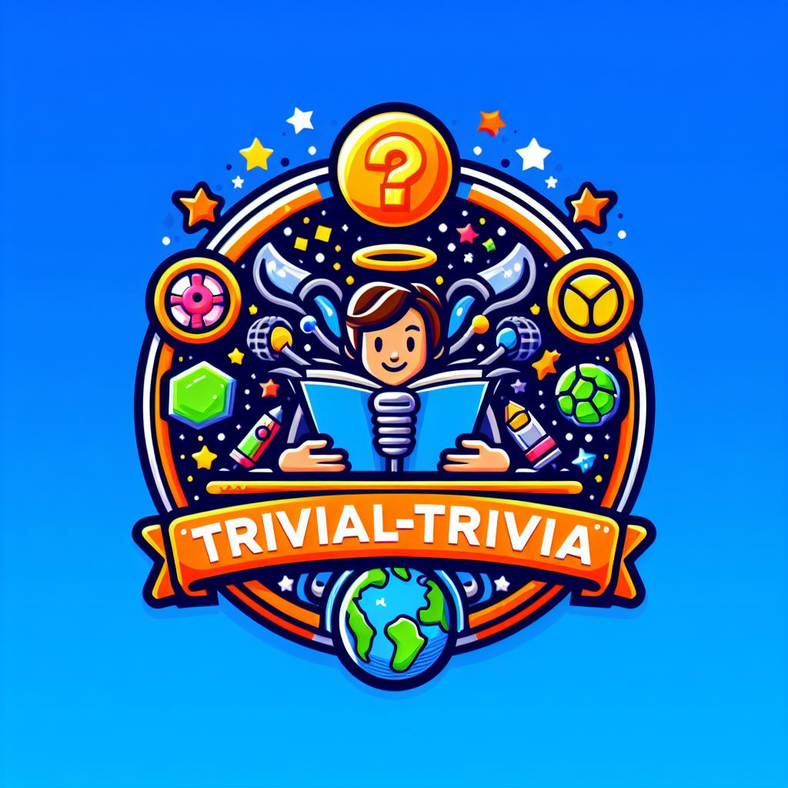

# Trivial Trivia

[](https://github.com/Powan55/Trivial-Trivia/actions/workflows/ci.yml)



A multiple-choice trivia game. Spring Boot serves it, JSP renders it, and the questions live in a
file you can swap for your own.

**[Play the demo](https://powan55.github.io/Trivial-Trivia/)** — the game loop, running in your
browser. Accounts, score history and import/export are server-side and need the app itself; see
[Running it](#running-it).

It started as a university project for two people and it shows in the git history: 25 pull
requests, a design document, and a set of sequence diagrams drawn before any of it was written.
Version 1.0.0 is the point where all of it actually works.

## What it does

- Ten questions a round, ten points for each correct answer. A wrong answer costs nothing but is
  counted.
- Accounts, with BCrypt-hashed passwords. You can also play as a guest.
- A score history per player. Guests do not get one, because there is nothing to key it to.
- Import and export the question set as CSV, JSON or XML. Importing needs an account.

## Running it

Java 17 and Maven.

```bash
mvn spring-boot:run
```

Then open <http://localhost:8080>.

Data lives in `~/.trivial-trivia/`, seeded from the shipped questions the first time the app
starts. Point it somewhere else if you like:

```bash
mvn spring-boot:run -Dspring-boot.run.arguments=--app.data.dir=/tmp/trivia
```

Nothing is written inside the project or into the packaged artifact.

## Tests

```bash
mvn -B clean verify
```

111 JUnit 5 tests: unit tests for the game, the adapters and the validators, and MockMvc tests
for every route. Coverage lands around 94% of lines; the build fails below 85%. The JaCoCo
report is written to `target/site/jacoco/index.html`.

Two of them are there specifically to stop old bugs coming back:
`PlayControllerTest.twoSessionsKeepSeparateScores` (the game state used to be a singleton) and
`FormatAdapterTest.theXmlParserDoesNotResolveExternalEntities`.

## How it is put together

| Package | What is in it |
| --- | --- |
| `Controller` | The routes: home, sign in, accounts, the game loop, scores, question import and export |
| `Service` | `GameService` — one round: the question order, the cursor into it, and the score |
| `Game` | `Question`, and `Questions` which loads them |
| `Authentication` | Sign-in, registration, form validation, and who is playing right now |
| `Database` | A `Database` interface with a CSV, a JSON and an XML implementation behind it |

Three of the patterns from the original design survived into the finished thing:

- **Adapter** — `Database` with `CSVAdapter`, `JSONAdapter` and `XMLAdapter` behind it.
  `FileDatabase` picks one by file extension, which is what makes import and export work in three
  formats without any caller knowing.
- **Proxy** — `ProxyUser` stands in for whoever is playing and refuses the things a guest may not
  do, such as keeping a score history.
- **MVC** — controllers, JSP views, and the model in between.

The Command layer from Sprint 1 did not survive: `Action.execute()` takes no arguments and returns
nothing, which cannot express an HTTP request, and Spring's handler methods are already the
dispatch it was trying to be.

The original design documents and sequence diagrams are under
[`SprintOne/`](SprintOne) — the [domain model](SprintOne/Diagrams/Domain%20Model%20TrivalTrivia%20.jpg),
the [database](SprintOne/Diagrams/Database.jpg) and [user authentication](SprintOne/Diagrams/User%20authentication.jpg)
diagrams still describe what the code does.

## The demo, and why it is only half the app

<https://powan55.github.io/Trivial-Trivia/> is a static page. GitHub Pages serves files and does
not run a server-side process, so what is deployed there is the game loop rewritten in about a
hundred lines of JavaScript, under [`site/`](site). It scores the same way `GameService` does: ten
points for a correct answer, nothing subtracted for a wrong one, answers compared ignoring case.

Everything that needs a server is missing from it — registering, signing in, a saved score
history, and an import that persists.

`questions.json` is generated from `QuestionData.csv` when the demo deploys rather than committed,
so adding a question to the real question set adds it to the demo too. Preview it locally with:

```bash
python scripts/questions-to-json.py src/main/resources/Data/QuestionData.csv site/questions.json
cp src/main/resources/static/images/Trivial-Trivia.jpg site/
python -m http.server 8081 --directory site
```

## Deploying the real thing

Packaging is `war`, so `mvn package` gives you `target/trivial-trivia-1.0.0.war` for any Tomcat
10.1 or later. There is no hosted instance of it: this used to run on Azure, the subscription
behind it was disabled, and the workflow that deployed there has been removed rather than left to
fail on every push.

## Known limits

- Data is flat files. That is fine for one process and it is not fine for two.
  [#46](https://github.com/Powan55/Trivial-Trivia/issues/46) tracks moving to SQL; the `Database`
  interface is the seam it would go behind.
- Sessions are in-memory, so a restart signs everyone out.
- There is no password reset, and no rate limit on sign-in attempts.

## License

[MIT](LICENSE).
